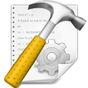

**************
**mk-project**
**************

:Author: Eddie Brüggemann

:Contact: mrcyberfighter@gmail.com

:License: GPLv3.

:version: 2.1

:website: `mk-project web page <http://www.open-source-projects.net/mk-project/mk-project>`_

Installation of **mk-project**
==============================

  **mk-project** is a **C**/**C++** project builder providing terminals for using

  the project with or without a T.U.I (Terminal User Interface) editor

  like **vim**, **emacs**, and so on.

  Simply enter:

  .. code-block:: bash
 
    $ ./configure        # This will perform a system check.
 
    $ make               # This will build the program.
 
    $ make strip         # Optionally removing unneeded symbols.
 
    $ sudo make install  # This will installing the program.

    # And for removing the program:

    $ sudo make uninstall

 
What **mk-project** provide ?
=============================

  **mk-project** generate you a ``Makefile`` based project
                                                          
  fully according to your settings...
                                                          
  * You can ``compile``, ``launch``, ``debug``, ``profiling`` and so on.

    Using optionally:
 
        + The binutils.
   
        + Oprofile.
   
        + Valgrind.
                                                          
  * You can ``format your source code`` with several tools !

        + **astyle**

        + **indent**

        + **bcpp**

  * You can ``generate documentation`` based on: sphinx.
                                                          
   With many output possibilities:
                                                         
   *man*, *info*, *html*, *pdf*, *epub*...

   .. note:: The man page builder is separate from the documenation generator.

    And is usable through the ``rst2man`` tool (python(3)-docutils).

                                                   
  * You can create an *archive from your project* !

    Using the tar, zip and rar archiving tools.

  And **mk-project** provide many others features !!!

  .. note::

    Once installed you can hack the code grace of the Makefile provided

    in the installing directory (${pkgdatadir}).

The little story of **mk-project**
==================================

  I have study in depth the ``GNU make manual`` and become acquainted with the

  **make** tool. So that I have implemented many targets in a big

  ``Makefile`` starting by simply automating the compilation process and

  the executable launching tasks to the complicated disassembling, profiling

  and so on.

  So I have construct a big ``Makefile`` for all kind of purposes.

Motivation for writing **mk-project**
=====================================

  I need a ``Makefile`` every time i write a program.

  So I decide to write a program which generate a ``Makefile`` according to the wanted settings.

  Which automate all the task i used to use or that i need sometimes.

  And because I use my I.T.E (Integrated Terminal Editor) `it-edit <http://www.open-source-projects.net/IT-Edit/IT-Edit_presentation.html>`_

  for writing programs i can simply type the targets into the terminals sidebar of `it-edit <http://www.open-source-projects.net/IT-Edit/IT-Edit_presentation.html>`_

  all that by writing my source codes...

  So I muss confess that I don't use the build-in terminals of mk-project for editing my files with **vim** per example.

  If someone agree with my program and is a T.U.I user thanks to give feedback.

Launching **mk-project**
========================

  You can launch **mk-project** in a terminal with a ``*.mkp`` file given as argument

    .. code-block:: bash

      $ mk-project /path/to/project_folder/prgname.mkp

  Or by using your file manager:

    Simply click on the ``*.mkp`` file in the project folder

    or

    Opening the ``*.mkp`` file with your file manager using the open with option.

  To open the **mk-project** G.U.I and loading the entire project.

  .. note:: At the end of a project generation *you can store your settings* for the next time you will build a project.

    So that the painful options searching and setting for every tool is stored.
 
    The used file extension is \*.mkpp for (**mk-project** profile).
 
**mk-project** G.U.I
====================

  The **mk-project** G.U.I is composed of a menu-bar and terminals.

  The menu bar contains following items:

  1. The ``Projects`` item which is done for

    * Generate a new project.

      ``Projects --> New project -> New project``
   
      ``Projects --> New project -> From profile``
 
    * Reconfigure a project.

      ``Projects --> Reconfigure project``
 
    * Extract and load project.

      ``Projects --> Extract and load project``

    * Add files to the project.

      ``Projects --> Add file(s) to project``

    * Load a project.

      ``Projects --> Load project``

  2. The ``Terminals`` item which is done for switching between the 2 sort of terminals:

    * The **make** terminal ``Terminals -> make terminal``

      Which output the **make** targets every time you launch one through the G.U.I.

    * The **edit** terminal ``Terminals -> edit terminal`` is suppose for **ed**, **vi**, **emacs**, etc users.

      You can add and remove as many tabs as you want to this, so that you can

      work on your source files by using **mk-project**.
 
  3. The ``targets`` item which display severals sub-menus for launching **make** targets according to your project configuration.

  4. The ``Configuration`` item which permit to configure the terminals.

  5. The ``Info`` item which permit to launch the HTML documentation of **mk-project** or the about window.

Shortcuts memo
==============

No shortcuts are implemented because of conflicting with the T.U.I (Terminal User Interface) editor.

Credits
=======

   Thanks to my beloved mother, my family and to the doctors.

   Stay away from drugs: drugs destroy your brain and your life.
